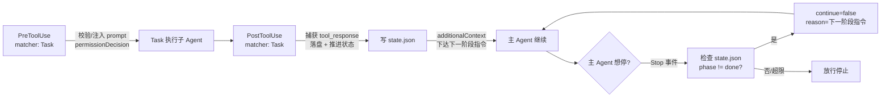

## 产品概述

把 `scripts/agent_orchestrator.py` 从「主 Agent 手动循环驱动」改造为「CodeBuddy hooks 事件驱动」，让多 Agent 工作流（阶段 0-5：scope / design / code / review / fix / test）在会话中自动流转，主 Agent 不再手写 `plan_next() → Task → submit()` 循环。

## 核心特性

- **事件自动流转**：子 Agent（Task 工具）执行完自动落盘产物、推进阶段状态、给出下一阶段指令；主 Agent 想早停时被拦截并被告知「还有哪一阶段没做」。
- **无需主 Agent 在场循环**：编排状态跨进程持久化到 `.codebuddy/run/{task}/state.json`，hooks 每次事件都是独立进程，靠读-改-写状态文件续接。
- **派发前校验/注入**：Task 调用前校验并注入阶段 prompt（如强制 scope 锚定），避免主 Agent 派错或漏带上下文。
- **安全护栏**：无活跃工作流时 hooks 完全不干预普通会话；强制继续次数、审查回退次数均设上限，超限转人工。
- **结构与契约不漂移**：领域规则引擎与 hook 协议适配层分离，同步更新 `agent_driver.md` 与漂移自检脚本，新增 hooks 注册校验项。

## 改造边界

- 允许同步调整下游消费方（`check_workflow_drift.py`、`benchmark/eval/*`、`agent_driver.md`）。
- 阶段 prompt 模板继续集中在 `scripts/prompts.py`，不搬回编排器。
- 领域 API（`OrchestrationState` / `run_*` / `check_*` / `STAGE_AGENT` / `MAX_AUTO_RETRIES`）保持稳定，避免误伤 benchmark 评测链路。

## 技术栈选型

- 语言/运行时：Python 3（与仓库 `scripts/` 现有脚本一致，无新增第三方依赖，仅用标准库 `json / argparse / pathlib / sys / os / tempfile / fcntl-or-msvcrt`）
- Hook 宿主：CodeBuddy Code hooks（Beta，v1.16.0+），配置落在项目级 `.codebuddy/settings.json`
- 执行壳：Git Bash（Windows 强制，不支持 PowerShell/cmd）
- 状态存储：JSON 文件（`.codebuddy/run/{task}/state.json`）+ 原子写 + 文件锁
- 现有依赖复用：`scripts/prompts.py`（阶段模板）、`.codebuddy/agents/*.md`（subagent 定义）

## 实现思路

### 核心判断：为什么必须用 PostToolUse 捕获产出

官方规范中 `Stop` / `SubagentStop` 的输入 JSON **只有 `stop_hook_active`，不含任何输出内容**。因此子 Agent 产出只能从 `PostToolUse`（带 `tool_input` + `tool_response`）直接取得，或在缺失时回落解析 `transcript_path`。这决定了事件分工：



### 架构分层（关注点分离）

1. **领域层（规则引擎）**：`scripts/agent_orchestrator.py` —— 只管「下一阶段是谁、要不要跳过、要不要回退、产物怎么落盘、怎么判定阻塞/伪绿」。不含 stdin/stdout、不含 hook 协议、不含 JSON 退出语义。
2. **适配层（I/O 边界）**：`scripts/orchestrator_hook.py` —— 只管「读 stdin JSON → 调领域层 → 写 stdout JSON + 退出码」。含 CLI 子命令。
3. **薄壳层**：`.codebuddy/hooks/*.sh` —— 只管「在 Git Bash 里找到 Python 解释器并转发 stdin/stdout」。
4. **配置层**：`.codebuddy/settings.json` 的 `hooks` 字段。
5. **状态层**：`.codebuddy/run/{task}/state.json` + `.codebuddy/run/.current` 指针。

### 关键设计决策与权衡

| 决策 | 选择 | 理由 / 权衡 |
| --- | --- | --- |
| 状态存放 | 落盘 `state.json` 而非内存 | hooks 每次事件是**独立新进程**，内存态必丢；这是改造的命门 |
| 产出捕获点 | `PostToolUse` matcher `Task` | 唯一能直接拿到 `tool_response` 的事件；`SubagentStop` 拿不到内容需解析 transcript，仅作兜底 |
| 流转驱动机制 | PostToolUse 给 `additionalContext`（建议性）+ Stop 给 `continue:false`（强制性） | 双保险：PostToolUse 是"顺带告知"，Stop 是"你不许停"，缺一会出现早停 |
| matcher 写法 | `^(Task\ | task)$` | 官方文档示例为 `Task`，本环境实测工具名为小写 `task`，正则**区分大小写**，需两者兼顾 |
| 领域 API | 保持不变 | `benchmark/eval/shop_agent_driver.py` 直接 import 这些符号；保持即零改动稳住评测链路 |
| Windows 解释器 | 薄壳内探测 `python3` → `python` → `py -3` | Windows 下 `python3` 常不存在，官方又强制 Git Bash 执行，必须探测 |
| 并发写 | 原子写（临时文件 + `os.replace`）+ 跨进程锁 | 官方明确"匹配的 hooks **并行执行**"，多事件同发时有覆盖风险 |
| 死循环防护 | `stop_forced` 计数上限 + 无活跃任务直接 exit 0 | `continue:false` 会让 Agent 无限干活，是本改造最大的失控风险 |


## 实现要点（执行细节）

### state.json Schema

```
{
  "version": 1,
  "task": "gateway-core",
  "user_request": "原始需求",
  "phase": "code",
  "created_at": "ISO8601",
  "updated_at": "ISO8601",
  "scope_ref": ".codebuddy/run/gateway-core/scope.md",
  "artifacts": {
    "design": {"path": "...", "stage": "design"},
    "code": {"path": "...", "stage": "code"},
    "review": {"path": "...", "stage": "review"},
    "tests": {"path": "...", "stage": "test"}
  },
  "blocking_issues": ["[BLOCKING] ..."],
  "retries": 0,
  "stop_forced": 0,
  "dispatched_stages": ["scope", "design"],
  "log": ["..."]
}
```

- `phase` 取值：`init → scope → design → code → review → fix → test → done`
- **读-改-写流程**：加锁 → 读 → 修改 → 写临时文件 → `os.replace` 原子替换 → 解锁
- 锁实现：`scripts/orchestrator_state.py` 内统一封装，Windows 用 `msvcrt.locking`，POSIX 用 `fcntl.flock`，锁文件为 `state.json.lock`

### 三个 hook 事件的完整逻辑

**1. PreToolUse（matcher `^(Task|task)）— 派发前校验/注入**

- stdin: `{tool_name, tool_input:{subagent_type, prompt, description}, session_id, transcript_path, cwd, permission_mode}`
- 逻辑：无活跃 workflow → exit 0；否则校验 `tool_input.prompt` 是否含当前阶段的 scope 锚定要求
- 输出：`{}`（放行，exit 0）；缺锚定时返回 `permissionDecision: "ask"` + `permissionDecisionReason`（不直接 deny，避免自伤正常调用）
- 可选：`modifiedInput` 补全 prompt（默认关闭，需 `--inject` 开关，遵循最小惊讶原则）

**2. PostToolUse（matcher `^(Task|task)）— 捕获产出并推进（核心）**

- stdin: `{tool_name, tool_input, tool_response, ...}`
- 取产物：`tool_response` 优先；缺失/为空时回落解析 `transcript_path` 最后一条 assistant 消息（防御式取值，官方 `tool_response` 形状因工具而异）
- 按 `state.phase` 归档：落盘到 `.codebuddy/run/{task}/` 对应文件（scope.md / design.md / code.diff / code.fix{N}.diff / review.md / tests.py）
- 领域判定：review 阶段扫 `[BLOCKING]`；test 阶段跑 `check_test_not_fakegreen`；scope 阶段跑 `check_granularity`
- 推进 `phase`（含 fix 回退分支，`retries` 达 `MAX_AUTO_RETRIES=2` 则转人工）
- 输出：`{"hookSpecificOutput":{"hookEventName":"PostToolUse","additionalContext":"下一阶段：用 Task 派发 <agent>，prompt：<...>"}}`，exit 0
- 全部阶段完成 → 写 `summary.json`，`phase="done"`，清理 `.current`

**3. Stop — 防早停**

- stdin: `{stop_hook_active, session_id, transcript_path, ...}`
- 逻辑（严格按序）：

1. 无 `.current` 或 state 不存在 → **立即 exit 0（零干预，保护普通会话）**
2. `phase == "done"` → exit 0（放行）
3. `stop_forced >= STOP_FORCED_MAX`（默认 3×阶段数）→ 输出 `systemMessage` 提示转人工，exit 0 放行
4. 否则 `stop_forced += 1` 原子自增，输出 `{"continue": false, "reason": "工作流未完成：当前阶段 X，请用 Task 派发 <agent>，prompt：<...>"}`，exit 0

- 注意：`continue:false` 用 exit 0 携带 JSON 输出，不走 exit 2（exit 2 是"阻塞错误"语义，会污染 transcript）

### CLI 子命令设计（`orchestrator_hook.py`）

| 子命令 | 用途 | 输入 | 输出 |
| --- | --- | --- | --- |
| `start` | 开启一次编排 | `--task` `--request` | 写 state.json（phase=init）+ `.current` 指针，打印首阶段指令 |
| `on-pre-task` | PreToolUse 钩子体 | stdin JSON | stdout JSON，exit 0 |
| `on-post-task` | PostToolUse 钩子体 | stdin JSON | stdout JSON，exit 0 |
| `on-stop` | Stop 钩子体 | stdin JSON | stdout JSON，exit 0 |
| `status` | 查看当前编排进度 | `--task`(可选，默认读 `.current`) | 人类可读进度 |
| `reset` | 中止并清理 | `--task` | 删除 `.current`，标记 state 为 aborted |
| `dry-run` | 离线验证阶段链（不消耗 token） | `--task` `--request` | 打印阶段流转结构 |


- 所有子命令共享约定：**调试日志一律写 stderr**（官方消息取值优先级 `stdout > stderr`，写 stderr 不会污染给 Agent 的反馈）

### 安全护栏清单（必须全部落地）

1. 无活跃 workflow → 所有 hook 立即 exit 0，绝不干预普通会话
2. `stop_forced` 上限（防 Stop hook 死循环），超限转人工并放行
3. `retries` 上限复用 `MAX_AUTO_RETRIES = 2`（审查阻塞回退），超限转人工
4. 每条 hook 配 `timeout`（建议 15s，远低于默认 60s，避免拖慢会话）
5. 原子写 + 文件锁，防并行 hooks 覆盖状态
6. 幂等：`dispatched_stages` 去重，同一阶段重复 PostToolUse 不重复推进
7. 路径校验：拒绝 `..` 路径穿越，task 名限制 `[A-Za-z0-9_-]+`
8. 敏感文件跳过：不读 `.env` / `.git/`
9. hooks 为 Beta，注册后需用户在 `/hooks` 面板审核生效（写入 README 说明）

### Windows Git Bash 兼容写法

```
"command": "\"$CODEBUDDY_PROJECT_DIR\"/.codebuddy/hooks/orch-post-task.sh"
```

薄壳内：

```
#!/usr/bin/env bash
set -euo pipefail
DIR="$(cd "$(dirname "${BASH_SOURCE[0]}")/../.." && pwd)"
if command -v python3 >/dev/null 2>&1; then PY=python3
elif command -v python >/dev/null 2>&1; then PY=python
else PY="py -3"; fi
exec $PY "$DIR/scripts/orchestrator_hook.py" on-post-task
```

## 目录结构

```
scripts/
├── agent_orchestrator.py        # [MODIFY] 领域层：纯规则引擎。剥离 hook 协议相关职责，
│                                #   保留并稳定 Artifact / OrchestrationState / run_* / check_* /
│                                #   STAGE_AGENT / MAX_AUTO_RETRIES / set_dispatcher；
│                                #   新增 state.json 序列化（to_dict/from_dict）与 phase 推进纯函数，
│                                #   不引入 stdin/stdout 与 JSON 退出语义
├── orchestrator_state.py        # [NEW] 状态持久化层：state.json 的读-改-写、原子写
│                                #   （临时文件 + os.replace）、跨进程文件锁（msvcrt/fcntl）、
│                                #   .current 指针读写、task 名与路径安全校验、schema 版本迁移
├── orchestrator_hook.py         # [NEW] 适配层（I/O 边界）：唯一处理 hook 协议的文件。
│                                #   解析 stdin JSON → 调领域层 → 输出 stdout JSON + 退出码；
│                                #   CLI 子命令 start / on-pre-task / on-post-task / on-stop /
│                                #   status / reset / dry-run；调试日志写 stderr
└── check_workflow_drift.py      # [MODIFY] 漂移自检：D1/D4 适配新结构；新增 D7 = hooks 注册校验
                                 #   （settings.json 的 hooks 事件/matcher/命令与 .codebuddy/hooks/*.sh
                                 #   文件真实存在且可执行）；新增 D8 = 子命令清单与文档一致

.codebuddy/
├── settings.json                # [MODIFY] 新增 hooks 字段：PostToolUse(matcher ^(Task|task)$)
│                                #   → orch-post-task.sh；Stop → orch-stop.sh；
│                                #   PreToolUse(matcher ^(Task|task)$) → orch-pre-task.sh；
│                                #   每条带 timeout；保留现有 permissions 不动
├── hooks/                       # [NEW] 薄壳层（Git Bash 可执行，需 chmod +x）
│   ├── orch-pre-task.sh         # [NEW] 解释器探测 + exec orchestrator_hook.py on-pre-task
│   ├── orch-post-task.sh        # [NEW] 解释器探测 + exec orchestrator_hook.py on-post-task
│   └── orch-stop.sh             # [NEW] 解释器探测 + exec orchestrator_hook.py on-stop
├── agents/
│   └── agent_driver.md          # [MODIFY] 主 Agent 伪代码从「手动 while 循环」改为「hooks 自动驱动」；
│                                #   补充 start/status/reset 用法、hooks 生效前提（/hooks 面板审核）、
│                                #   stop_forced 护栏说明；stage→subagent 表与阈值保持不变
└── run/
    ├── .current                 # [NEW] 当前活跃 task 指针文件（纯文本 task 名）
    └── {task}/
        ├── state.json           # [NEW] 跨进程编排状态（含 phase/retries/stop_forced/dispatched_stages）
        ├── state.json.lock      # [NEW] 锁文件（运行时生成）
        └── scope.md/...         # [EXISTING] 各阶段产物（落盘约定不变）

benchmark/eval/
├── shop_agent_driver.py         # [MODIFY] 按新签名适配（领域 API 保持稳定，预计仅需微调 import
│                                #   或改用 run_workflow 统一入口；若领域 API 未变则可不改）
└── run_eval.py                  # [MODIFY] 同上，确认 set_dispatcher 注入路径仍可用
```

## 关键代码结构

状态读写与阶段推进的核心契约（接口级定义，实现时严格遵循）：

```python
# scripts/orchestrator_state.py
def load(task: str) -> dict | None: ...
def update(task: str, mutator: Callable[[dict], dict]) -> dict: ...  # 加锁 + 原子写
def current_task() -> str | None: ...                                # 读 .current 或 ORCH_TASK env
def set_current(task: str) -> None: ...
def clear_current() -> None: ...
```

```python
# scripts/agent_orchestrator.py（领域层，纯函数，无 I/O 副作用以外的协议耦合）
def advance(state: OrchestrationState, stage: str, output: str) -> str:
    """归档 output 并推进 phase，返回下一 phase（'done' 表示编排完成）。

    纯领域逻辑：不读 stdin、不写 stdout、不感知 hook 事件名。
    """

def next_instruction(state: OrchestrationState) -> str | None:
    """生成给主 Agent 的下一阶段指令文案（含 subagent 名与 prompt），done 时返回 None。"""
```

```python
# scripts/orchestrator_hook.py（适配层）
def main() -> int:
    """子命令分发：start / on-pre-task / on-post-task / on-stop / status / reset / dry-run。

    不变量：
      - 调试日志一律 stderr；
      - 无活跃 workflow 时一律 exit 0 且 stdout 为空（零干预）；
      - 仅 on-stop 可能输出 continue:false，且受 stop_forced 上限约束。
    """
```

## 验证方式

1. **离线喂 JSON 测 hook**（不启动 CodeBuddy）：

- `type payload.json | python scripts/orchestrator_hook.py on-post-task`（Windows PowerShell）或 `python ... < payload.json`
- 断言 stdout 是合法 JSON、`state.json` 中 `phase` 已推进、产物文件已生成

2. **零干预回归**：在无 `.current` 的情况下喂 Stop 事件 JSON，断言 stdout 为空且 exit 0（保护普通会话）
3. **死循环回归**：构造 `stop_forced` 已达上限的 state，喂 Stop，断言放行（`continue` 不为 false）
4. **dry-run 全链路**：`python scripts/orchestrator_hook.py dry-run --task x --request "..."`，断言阶段链输出与改造前一致
5. **漂移自检**：`python scripts/check_workflow_drift.py` 退出码 0
6. **benchmark 回归**：`python -m pytest` 与 `run_eval.py` 行为与改造前一致（领域 API 稳定的验收证据）
7. **hooks 生效确认**：`codebuddy` 内 `/hooks` 面板审核通过，跑一次真实编排观察自动流转

## Agent Extensions

### SubAgent

- **architecture-designer**
- 用途：在动手前评审分层方案（领域层 / 适配层 / 薄壳层 / 配置层）的边界划分与 state.json 契约是否合理，尤其是「规则引擎 vs hook 适配层」的职责切分
- 预期产出：确认分层无循环依赖、状态机 phase 迁移图完整（含 fix 回退与转人工分支）、接口签名可直接落地

- **code-reviewer**
- 用途：在适配层与状态持久化层实现完成后做一轮代码审查，重点查跨进程并发安全、Windows 锁实现、路径穿越、Stop hook 死循环防护
- 预期产出：明确的阻塞/警告/建议分级清单，无 `[BLOCKING]` 残留方可收尾