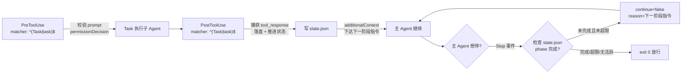

## 产品概述

把 `scripts/agent_orchestrator.py` 从「主 Agent 手动循环驱动」改造为「CodeBuddy hooks 事件驱动」，让多 Agent 工作流（阶段 0-5：scope / design / code / review / fix / test）在真实会话中自动流转，主 Agent 不再手写 `plan_next() → Task → submit()` 循环。

## 核心特性

- **事件自动流转**：子 Agent（Task 工具）执行完自动落盘产物、推进阶段状态、产出下一阶段指令；主 Agent 想早停时被拦截并被告知「还有哪一阶段没做」。
- **跨进程状态续接**：hooks 每次事件是独立进程，编排状态持久化到 `.codebuddy/run/{task}/state.json`，靠读-改-写续接。
- **派发前校验**：Task 调用前校验阶段 prompt（缺 scope 锚定时用 `ask` 提示，不直接 `deny` 避免自伤正常调用）。
- **安全护栏**：无活跃工作流时 hooks 零干预普通会话；强制继续次数、审查回退次数均设上限，超限转人工。
- **单一真相源**：`advance()` 为纯领域函数，hooks 与离线 eval 共用同一段阶段流转逻辑，杜绝双实现漂移。
- **三层测试**：领域层用 golden_tasks（已有）、适配层新增 fixture 单测（13 条，本次补齐）、配置层用 drift 自检（扩展 D7/D8）。

## 改造边界

- 删除 `Orchestrator` 手动驱动类（hooks 取代后为死代码），而非保留兼容。
- harness（`benchmark/eval/code_eval_harness`，git submodule）**保留且本身不改**，仅升级其 driver。
- 阶段 prompt 模板继续集中在 `scripts/prompts.py`，不搬回编排器。
- 领域 API（`OrchestrationState` / `run_*` / `check_*` / `MAX_AUTO_RETRIES` / `set_dispatcher`）保持稳定，避免误伤 benchmark 评测链路。
- harness 未接 CI（`.github/workflows/` 零引用）属独立改进，本次不处理。

## 技术栈选型

- **语言/运行时**：Python 3 标准库（`json / argparse / pathlib / sys / os / tempfile / msvcrt|fcntl / re / subprocess`），无新增第三方依赖，与仓库 `scripts/` 现有脚本一致
- **Hook 宿主**：CodeBuddy Code hooks（Beta，v1.16.0+），配置落在项目级 `.codebuddy/settings.json`
- **执行壳**：Git Bash（Windows 强制，不支持 PowerShell/cmd），单个 `orch.sh` 薄壳
- **状态存储**：JSON 文件（`.codebuddy/run/{task}/state.json`）+ 原子写 + 跨进程文件锁
- **复用资产**：`scripts/prompts.py`（阶段模板）、`.codebuddy/agents/*.md`（subagent 定义）、`benchmark/eval/code_eval_harness`（判据层，不改）

## 实现思路

### 核心判断一：为什么必须用 PostToolUse 捕获产出

官方规范中 `Stop` / `SubagentStop` 的输入 JSON **只有 `stop_hook_active`，不含任何输出内容**。因此子 Agent 产出只能从 `PostToolUse`（带 `tool_input` + `tool_response`）直接取得，缺失时回落解析 `transcript_path`。这决定了事件分工：



### 核心判断二：`advance()` 必须是纯领域函数

这是本次改造最关键的一条契约。`advance()` 只吃 `OrchestrationState`、不碰 `state.json`、不读 stdin、不写 stdout、不感知 hook 事件名。**持久化是适配层的职责**（hook 层 `load → advance → save`）。

若 `advance()` 耦合了文件持久化，离线 eval 就无法复用它，会立刻重演「两套并行实现」的漂移病灶。

### 架构分层（四层关注点分离）

| 层 | 文件 | 职责 | 禁止 |
| --- | --- | --- | --- |
| 领域层 | `scripts/agent_orchestrator.py` | 下一阶段是谁、是否跳过、是否回退、产物落盘、阻塞/伪绿判定 | 不得出现 stdin/stdout、hook 事件名、JSON 退出语义 |
| 状态层 | `scripts/orchestrator_state.py` | state.json 读-改-写、原子写、文件锁、`.current` 指针、路径校验 | 不得含阶段规则 |
| 适配层 | `scripts/orchestrator_hook.py` | 唯一处理 hook 协议：stdin JSON → 领域层 → stdout JSON + 退出码；CLI 子命令 | 不得含阶段规则 |
| 薄壳层 | `.codebuddy/hooks/orch.sh` | Git Bash 下探测 Python 解释器并转发 `$1` 子命令 + stdin/stdout | 不得含任何业务逻辑 |


### 关键设计决策与权衡

| 决策 | 选择 | 理由 / 权衡 |
| --- | --- | --- |
| 状态存放 | 落盘 `state.json` | hooks 每次事件是独立新进程，内存态必丢；这是改造命门 |
| 产出捕获点 | `PostToolUse` matcher `^(Task\ | task)$` | 唯一能直接拿到 `tool_response` 的事件；`SubagentStop` 无输出内容，仅兜底 |
| 流转驱动 | PostToolUse 给 `additionalContext`（建议性）+ Stop 给 `continue:false`（强制性） | 双保险，缺一会早停 |
| matcher 写法 | `^(Task\ | task)$` | 官方示例 `Task`、本环境实测小写 `task`，正则区分大小写，两者兼顾 |
| 薄壳数量 | **1 个 `orch.sh`**，子命令由 `$1` 传入 | 原方案 3 个 `.sh` 内容 99% 重复，纯冗余 |
| `Orchestrator` 类 | **删除** | hooks 取代手动驱动后为死代码；保留即与 `advance()` 形成新双实现 |
| `STAGE_AGENT` | 提为**模块级常量** | 类删除后仍要供 drift 检查 D1 与 `next_instruction()` 使用 |
| `run_*` | 降级为 `advance()` 薄包装 | benchmark API 零变化，但 eval 自动测到与 hooks 相同的逻辑 |
| `advance()` 纯净性 | 不耦合 state.json | 否则 eval 无法复用，双实现漂移重现 |
| 并发写 | 原子写（临时文件 + `os.replace`）+ 跨进程锁 | 官方明确「匹配的 hooks 并行执行」 |
| 死循环防护 | `stop_forced` 上限 + 无活跃任务直接 exit 0 | `continue:false` 会让 Agent 无限干活，最大失控风险 |
| 测试分层 | golden_tasks（领域）+ **新增 fixture 单测（适配层）**+ drift（配置） | golden_tasks 只评价产物，覆盖不到协议/护栏/并发，风险最高的新代码原本零覆盖 |


## 实现要点（执行细节）

### state.json Schema

```
{
  "version": 1,
  "task": "gateway-core",
  "user_request": "原始需求",
  "phase": "code",
  "created_at": "ISO8601",
  "updated_at": "ISO8601",
  "scope_ref": ".codebuddy/run/gateway-core/scope.md",
  "artifacts": {"design": {"path": "...", "stage": "design"}},
  "blocking_issues": ["[BLOCKING] ..."],
  "retries": 0,
  "stop_forced": 0,
  "dispatched_stages": ["scope", "design"],
  "log": ["..."]
}
```

- `phase` 取值：`init → scope → design → code → review → fix → test → done`
- 读-改-写流程：加锁 → 读 → 修改 → 写临时文件 → `os.replace` 原子替换 → 解锁
- 锁：Windows `msvcrt.locking` / POSIX `fcntl.flock`，锁文件 `state.json.lock`
- 路径安全：task 名限 `[A-Za-z0-9_-]+`，拒绝 `..` 路径穿越

### 三个 hook 事件的完整逻辑

**1. PreToolUse — 派发前校验**

- stdin：`{tool_name, tool_input:{subagent_type, prompt, description}, session_id, transcript_path, cwd, permission_mode}`
- 无活跃 workflow → exit 0 且 stdout 为空（零干预）
- 否则校验 `tool_input.prompt` 是否含当前阶段的 scope 锚定
- 缺锚定时返回 `permissionDecision: "ask"` + `permissionDecisionReason`（**不 `deny`**，避免自伤正常调用）
- `modifiedInput` 自动补全默认关闭，需显式开关（最小惊讶原则）

**2. PostToolUse — 捕获产出并推进（核心）**

- 取产物：`tool_response` 优先；缺失或为空时回落解析 `transcript_path` 最后一条 assistant 消息（防御式取值，官方 `tool_response` 形状因工具而异）
- 按 `state.phase` 归档落盘：`scope.md / design.md / code.diff / code.fix{N}.diff / review.md / tests.py`
- 领域判定：review 扫 `[BLOCKING]`；test 跑 `check_test_not_fakegreen`；scope 跑 `check_granularity`
- 推进 phase（含 fix 回退分支，`retries` 达 `MAX_AUTO_RETRIES=2` 转人工）
- 输出 `{"hookSpecificOutput":{"hookEventName":"PostToolUse","additionalContext":"下一阶段：用 Task 派发 <agent>，prompt：<...>"}}`，exit 0
- 全部完成 → 写 `summary.json`、`phase="done"`、清理 `.current`

**3. Stop — 防早停（严格按序）**

1. 无 `.current` 或 state 不存在 → **立即 exit 0，stdout 为空**（保护普通会话）
2. `phase == "done"` → exit 0 放行
3. `stop_forced >= STOP_FORCED_MAX` → 输出 `systemMessage` 提示转人工，exit 0 放行
4. 否则 `stop_forced += 1` 原子自增，输出 `{"continue": false, "reason": "工作流未完成：当前阶段 X，请用 Task 派发 <agent>，prompt：<...>"}`，exit 0

注意：`continue:false` 用 **exit 0 携带 JSON**，不走 exit 2（exit 2 是「阻塞错误」语义，会污染 transcript）。

### 安全护栏清单（必须全部落地）

1. 无活跃 workflow → 所有 hook 立即 exit 0、stdout 为空，绝不干预普通会话
2. `stop_forced` 上限（防 Stop hook 死循环），超限转人工并放行
3. `retries` 上限复用 `MAX_AUTO_RETRIES = 2`，超限转人工
4. 每条 hook 配 `timeout: 15`（远低于默认 60s，避免拖慢会话）
5. 原子写 + 文件锁，防并行 hooks 覆盖状态
6. 幂等：`dispatched_stages` 去重，同一阶段重复 PostToolUse 不重复推进
7. 路径校验：拒绝 `..` 穿越，task 名限 `[A-Za-z0-9_-]+`
8. 敏感文件跳过：不读 `.env` / `.git/`
9. **所有调试日志一律写 stderr**（官方消息取值优先级 `stdout > stderr`，写 stderr 不污染给 Agent 的反馈）
10. hooks 为 Beta，注册后需用户在 `/hooks` 面板审核生效（写入 `agent_driver.md` 说明）

### Windows Git Bash 兼容

`.codebuddy/hooks/orch.sh`（唯一薄壳，子命令由 `$1` 传入）：

```
#!/usr/bin/env bash
set -euo pipefail
DIR="$(cd "$(dirname "${BASH_SOURCE[0]}")/../.." && pwd)"
if command -v python3 >/dev/null 2>&1; then PY=python3
elif command -v python >/dev/null 2>&1; then PY=python
else PY="py -3"; fi
exec $PY "$DIR/scripts/orchestrator_hook.py" "$1"
```

settings.json 中三条 command 分别传 `on-pre-task` / `on-post-task` / `on-stop`。

## 目录结构

```
scripts/
├── agent_orchestrator.py        # [MODIFY] 领域层：纯规则引擎。删除 Orchestrator 类（约 140 行手动驱动死代码）；
│                                #   新增 advance()/next_instruction() 纯函数（不耦合 state.json）；
│                                #   run_* 降级为「派发 + advance()」薄包装；
│                                #   STAGE_AGENT 提为模块级常量；
│                                #   保留 Artifact/OrchestrationState/run_*/check_*/MAX_AUTO_RETRIES/set_dispatcher
├── orchestrator_state.py        # [NEW] 状态层：state.json load/update（加锁+原子写）、.current 指针读写、
│                                #   原子写（临时文件+os.replace）、跨进程锁（msvcrt/fcntl）、
│                                #   task 名与路径安全校验、schema 版本字段
├── orchestrator_hook.py         # [NEW] 适配层（I/O 边界）：唯一处理 hook 协议的文件。
│                                #   解析 stdin JSON → 调领域层 → 输出 stdout JSON + 退出码；
│                                #   子命令 start / on-pre-task / on-post-task / on-stop /
│                                #   status / reset / dry-run；调试日志写 stderr
├── test_orchestrator_hook.py    # [NEW] 适配层 fixture 单测：13 条固定 JSON 用例，补零覆盖缺口。
│                                #   范式参照 scripts/test_ci_failure_triage.py
└── check_workflow_drift.py      # [MODIFY] D1 改解析模块级 STAGE_AGENT；
                                 #   新增 D7 = settings.json hooks 注册与 .codebuddy/hooks/orch.sh 一致；
                                 #   新增 D8 = 子命令清单与 agent_driver.md 一致

.codebuddy/
├── settings.json                # [MODIFY] 新增 hooks 字段：PostToolUse/PreToolUse(matcher ^(Task|task)$)、
│                                #   Stop，均调 orch.sh 并传子命令，各带 timeout:15；
│                                #   保留现有 permissions 不动
├── hooks/
│   └── orch.sh                  # [NEW] 唯一薄壳：解释器探测 + exec orchestrator_hook.py "$1"（需 chmod +x）
├── agents/
│   └── agent_driver.md          # [MODIFY] 伪代码从手动 while 循环改为 hooks 自动驱动；
│                                #   补 start/status/reset 用法、/hooks 面板审核前提、stop_forced 护栏；
│                                #   stage→subagent 表与阈值保持不变
└── run/
    ├── .current                 # [NEW] 当前活跃 task 指针（纯文本）
    └── {task}/
        ├── state.json           # [NEW] 跨进程编排状态
        ├── state.json.lock      # [NEW] 锁文件（运行时生成）
        └── scope.md/...         # [EXISTING] 各阶段产物，落盘约定不变

benchmark/eval/
├── shop_agent_driver.py         # [MODIFY] 驱动完整阶段链（含 review 与 fix 回退），
│                                #   补「评测从未覆盖 [BLOCKING] 判定与 MAX_AUTO_RETRIES 回退」的盲区
└── code_eval_harness/           # [KEEP] git submodule，判据层，本次不改
```

## 关键代码结构

```python
# scripts/orchestrator_state.py —— 状态层，只管持久化，不含阶段规则
def load(task: str) -> dict | None: ...
def update(task: str, mutator: Callable[[dict], dict]) -> dict: ...  # 加锁 + 原子写
def current_task() -> str | None: ...                                # 读 .current 或 ORCH_TASK env
def set_current(task: str) -> None: ...
def clear_current() -> None: ...
```

```python
# scripts/agent_orchestrator.py —— 领域层纯函数
def advance(state: OrchestrationState, stage: str, output: str) -> str:
    """归档 output 并推进阶段，返回下一 phase（'done' 表示编排完成）。

    硬约束：不读 stdin、不写 stdout、不感知 hook 事件名、不触碰 state.json。
    持久化由适配层负责，否则离线 eval 无法复用本函数。
    """

def next_instruction(state: OrchestrationState) -> str | None:
    """生成给主 Agent 的下一阶段指令文案（含 subagent 名与 prompt），done 时返回 None。"""

STAGE_AGENT: dict[str, str]  # 模块级常量，供 next_instruction 与 drift 检查 D1 使用
```

```python
# scripts/orchestrator_hook.py —— 适配层
def main() -> int:
    """子命令分发：start / on-pre-task / on-post-task / on-stop / status / reset / dry-run。

    不变量：
      - 调试日志一律 stderr；
      - 无活跃 workflow 时一律 exit 0 且 stdout 为空（零干预）；
      - 仅 on-stop 可能输出 continue:false，且受 stop_forced 上限约束。
    """
```

## 验证方式

1. **离线喂 JSON 测三事件**：`type payload.json | python scripts/orchestrator_hook.py on-post-task`，断言 stdout 为合法 JSON、产物落盘、phase 推进
2. **零干预回归**：无 `.current` 时喂 Stop，断言 stdout 为空且 exit 0（保护普通会话）
3. **死循环回归**：构造 `stop_forced` 达上限的 state 喂 Stop，断言放行
4. **`test_orchestrator_hook.py` 13 条全绿**（见 todolist 用例清单）
5. **dry-run 阶段链**与改造前一致
6. **drift 自检**：`python scripts/check_workflow_drift.py` 退出码 0
7. **benchmark 回归**：`run_eval.py` 行为与改造前一致，且 eval 覆盖到 review/fix 分支
8. **真实会话确认**：`/hooks` 面板审核通过后观察自动流转（需用户手工确认）

## Agent Extensions

### SubAgent

- **architecture-designer**
- 用途：动手前评审四层边界（领域层 / 状态层 / 适配层 / 薄壳层）划分与 `state.json` 契约，重点确认「`advance()` 保持纯净、持久化归适配层」这一核心约束无循环依赖
- 预期产出：phase 状态机迁移图完整（含 fix 回退、design 跳过、超限转人工分支）；`advance()` / `next_instruction()` / `orchestrator_state` 接口签名可直接落地

- **code-reviewer**
- 用途：适配层与状态层实现完成后做代码审查，重点查跨进程并发安全、Windows `msvcrt` 锁实现、路径穿越、Stop hook 死循环防护、stdout/stderr 纪律
- 预期产出：阻塞/警告/建议分级清单，无 `[BLOCKING]` 残留方可收尾