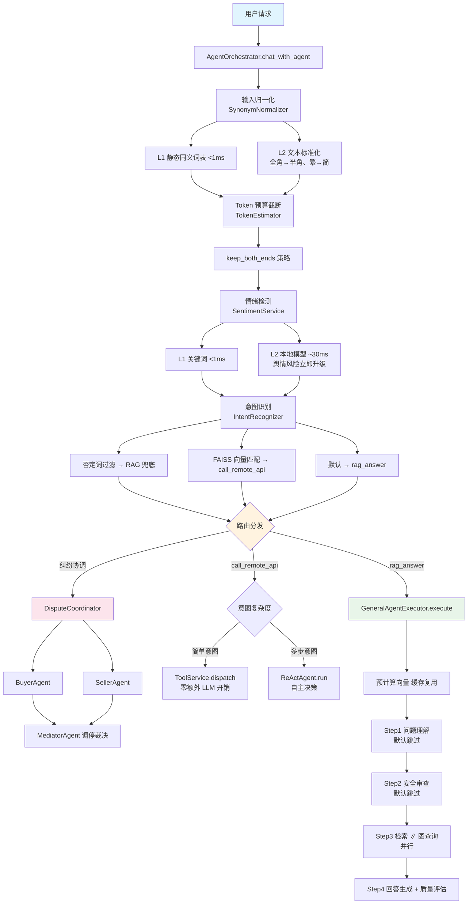

# Shop-Agent 智能客服系统

基于 **RAG（检索增强生成）** 与 **Agent 编排** 构建的智能客服平台，面向电商场景提供 AI 对话服务。

## 功能概览

### 1. Agent 编排与路由

系统采用 **Orchestrator 模式**（`AgentOrchestrator`），按以下流程统一处理请求：

- **输入归一化** — 同义词归一化 `SynonymNormalizer`（L1 静态映射 <1ms + L2 文本标准化，默认开启；L3 LLM 兜底按配置关闭）
- **情绪检测** — `SentimentService` 级联分类器（L1 关键词 <1ms → L2 本地模型 ~30ms → L3 云端 LLM 兜底），舆情风险（如"打12315"）立即升级不走后续管线
- **Token 预算截断** — 用户输入超 `MAX_USER_MESSAGE_TOKENS` 时智能截断（`keep_both_ends` 策略，保留首 40%+尾 20%，中间插入省略标记）
- **意图识别** — 基于 FAISS 向量匹配进行本地意图分类（`IntentRecognizer`），识别 `query-order`、`check-shipping`、`request-return`、`check-balance`、`coupon-inquiry` 五种业务意图，支持否定词过滤（含"退货政策/退款流程/怎么退"等咨询类模式 → 直接走 RAG）和 LLM 兜底模式
- **路由分发** — 意图命中后，先做纠纷协调检测（情绪 angry + 退货意图 → `DisputeCoordinator` 三方协调），再根据复杂性检测分发：
  - **纠纷协调**：BuyerAgent（买方诉求）+ SellerAgent（卖方立场）并行分析 → MediatorAgent 调停裁决
  - **ReAct Agent**：多步意图（含推理/条件判断/退货类），由 `ReActAgent` 自主决策
  - **直接 Tool 调用**：简单意图，参数抽取后直接调用对应工具，零额外 LLM 开销
- **RAG Agent 兜底**：未命中意图的通用问答，走 `GeneralAgentExecutor` 的 4 步流水线（问题理解 → 内容审查 → 知识检索 → 回答生成）
- **人在回路**：退款审批场景，Agent 自动暂停返回 `waiting_for_confirmation` 状态，管理员通过 `/agent/refund/confirm` 确认或拒绝

### 2. ReAct Agent（工具调用 + RAG 融合）

基于 LangChain `create_agent` + LangGraph `MemorySaver` 的 ReAct 循环，配套三层工具选择策略：

- **P0 意图前置过滤**：`INTENT_TOOL_MAP`（Skill 注册表自动构建）→ 缩减候选工具池到 2-5 个
- **P2 FAISS 语义重排**：用户 query × 工具描述 HNSW 向量相似度 + 意图加权 ×1.5 → Top-3/5
- **P1 本地模型确认**：本地小模型（`LocalModelService`，加载 `LOCAL_PARAM_MODEL` 配置的模型）从 Top-3/5 中选出最相关的工具，含 P2 交叉校验（P1 丢弃 P2 top-1 时强制补回）；不可用时回退到 `LLMToolSelectorMiddleware` 云端兜底

Agent 行为由 **Skill SOP 内联注入** 驱动：启动时 `SkillLoader` 从 `skills/*/SKILL.md` 加载 YAML frontmatter + Markdown 正文到 `SkillRegistry`，运行时命中 Skill 后将 SOP 正文注入 system prompt，实现"增加新业务只改配置"。

### 3. RAG 智能对话

支持两种 RAG 路径：
- **简单 RAG**（`/chat`）：Embedding → Milvus 向量检索 → LLM 生成，含输入归一化 + 输出内容安全过滤
- **Agent RAG**（`/agent/chat` − `GeneralAgentExecutor`）：4 步流水线：
  - Step 1 问题理解/改写（默认禁用，ecommerce domain）
  - Step 2 内容安全审查（默认禁用，含本地小模型优先 + 云端 LLM 复核的双层策略）
  - Step 3 知识检索（Milvus 2.6 原生混合检索 Dense + Sparse BM25 + NebulaGraph 图查询并行）
  - Step 4 回答生成 + 规则质量评估（基于回答长度、检索上下文完整性、低质量模式检测打分）+ 输出安全过滤
- **预计算向量复用**：execute() 入口预计算 question embedding，供 step3 检索复用，避免重复调用 Embedding API
- **BGE-Reranker 重排序**：`RerankerService` 对检索结果按相关性重新打分和低相关截断（同步 CPU 推理通过 `loop.run_in_executor` 放入线程池）
- **LLM 相关性过滤**：检索结果经 LLM 判断语义相关性，过滤无关文档（最多传 20 条给 LLM）
- **NebulaGraph 图查询增强**：商品关系图谱（同品牌/兼容配件/替代品）与 Milvus 检索并行执行，结果注入 step4 prompt，解决纯向量检索无法处理的"同品牌有什么""这个商品有什么配件"类问题

### 4. 文档知识库管理

支持向 Milvus 向量知识库导入文档，提供单条插入（`POST /chatagent/documents`）、批量插入（`POST /chatagent/documents/batch`）和文件上传（`POST /chatagent/documents/upload`，支持 `.txt` / `.md` / `.csv` / `.json` / `.xml` / `.html` / `.py` / `.java` 等常见文本格式）三种方式。内部两层切分策略：`SemanticChunker` 语义切分（`percentile` 模式，阈值 85）→ Token 安全兜底（超限 chunk 用 `RecursiveCharacterTextSplitter` 二次切分）。

### 5. 商品嵌入与搜索

支持将商品标题向量化存入 Milvus（`POST /chatagent/items/embed`），批量嵌入（`POST /chatagent/items/embed/batch`），及文件上传嵌入（`POST /chatagent/items/embed/file`，`.txt/.tsv/.csv`）。支持 Milvus 混合检索搜索商品（`POST /chatagent/items/search`），按 item_id 去重。

### 6. 企业信息查询

基于 MySQL 的 `Enterprise` 模型（企业名称/信用代码/法人/注册资本/经营范围/经营状态/风险等级等），Repository 层支持模糊匹配、精确匹配、地区/行业筛选等多维度查询，路由前缀为 `/reports`（`src/modules/items`）。

### 7. 问题缓存去重

基于 Redis Stack 的向量相似度搜索（`RedisCacheService`），支持 SHA256 精确哈希匹配与向量余弦相似度匹配双重策略。缓存回答经质量评估（规则打分 ≥ 6）后存储。同时支持对话历史存储（按 conversation_id 分 key，24 小时过期）和高频问题统计（Sorted Set），包含问题脱敏处理（移除电话号码、邮箱、身份证号、详细地址）。

### 8. 内容安全过滤

`ContentFilterService` 纯规则引擎（零 LLM 成本），提供：
- **输入过滤**：拦截明显恶意/非法内容 + Prompt Injection 检测
- **输出过滤**：按领域（medical/ecommerce/customer_service/general）配置 block/replace 关键词表，LLM 输出在返回用户前强制扫描
- 纵深防御位置：编排器入口 → Agent step2 输入审查 → 执行器输出过滤

### 9. Prometheus 可观测性

通过 `prometheus-fastapi-instrumentator` 自动暴露 HTTP 请求指标（排除 /health、/docs 等路径），同时定义了业务自定义指标（API 调用、数据库查询、Milvus 检索、Embedding 请求、Redis 缓存、Agent 对话轮次、Token 消耗、异常统计），并实现 LangChain 标准回调处理器（`PrometheusCallbackHandler`）追踪 LLM 调用、Embedding 请求、Agent 执行、Tool 调用等事件。

### 10. SkyWalking 分布式链路追踪

通过 `skywalking_client` 集成 Apache SkyWalking Python Agent（gRPC 上报），为每个 HTTP 请求创建 EntrySpan 记录响应状态/耗时/异常，与 Prometheus 指标监控互补。优雅降级：SkyWalking 不可用时不影响主业务。

### 11. Langfuse 全链路追踪

通过 `langfuse.langchain.CallbackHandler` + `propagate_attributes()` 上下文管理器（v4.x 规范）实现 LLM 调用、Agent 执行、意图识别、参数抽取、工具匹配等全链路追踪，每个请求创建独立 trace（session_id / tags / trace_name），应用 shutdown 时 flush 确保数据不丢失。

### 12. 参数抽取

支持四种模式（`PARAM_EXTRACTION_MODE`），逐级兜底：
- **local_strict**：纯正则 + 关键词（毫秒级，零 API），不降级
- **local**：正则 → 失败降级 local_model → 失败降级 llm（默认）
- **local_model**：transformers 本地小模型 → 失败降级 llm
- **llm**：Qwen structured output，最精准

---

## 系统架构

### 编排队列



### 模块划分

| 模块 | 职责 |
|------|------|
| `src/core` | 全局配置管理（Pydantic Settings），含 LLM/Embedding/Milvus/意图识别/参数抽取/NebulaGraph/Token 限流等全部配置项；Token 预估器（基于 HF tokenizers 的 Qwen3 BPE 编码，LRU 缓存）；速率限制器（Redis 滑动窗口 + 内存降级，含请求次数与 Token 消耗双维度） |
| `src/shared` | 异步数据库引擎（SQLAlchemy 2.0 + aiomysql）、统一异常体系（BusinessException/401/403/404/422/500）、结构化日志（structlog）、统一响应格式（BaseResponse） |
| `src/modules/auth` | Bearer Token API Key 认证鉴权（HTTPBearer + FIXED_API_KEY 比对），含 `get_current_user` / `require_admin` 依赖 |
| `src/modules/chat` | 智能客服核心模块 |
| `src/modules/chat/agent` | Agent 编排（`AgentOrchestrator`）+ 通用执行器（`GeneralAgentExecutor`）+ ReAct Agent（`ReActAgent`）+ Skill 加载器（`SkillLoader` / `SkillRegistry`）+ 提示词管理（`PromptTemplateManager`）+ 纠纷协调器（`DisputeCoordinator`） |
| `src/modules/chat/core` | LLM 服务、Embedding 服务（local BGE / volcengine 可选）、Milvus 混合检索服务、Redis 缓存服务、意图识别器（FAISS）、文档服务（SemanticChunker）、Reranker 服务（BGE-Reranker-base）、工具注册与服务（`ToolService`）、本地模型服务（`LocalModelService`）、内容安全过滤（`ContentFilterService`）、同义词归一化（`InputNormalizer`）、情绪检测（`SentimentService`）、NebulaGraph 图查询服务、参数抽取器（`LocalParamExtractor`） |
| `src/modules/items` | 企业信息查询（Enterprise 模型/Schema/Repository），路由注册为 `/reports` |
| `src/modules/monitoring` | Prometheus 指标定义 + LangChain 回调 + Langfuse 回调 + SkyWalking 分布式追踪客户端 |

---

## 关键设计决策

### 大模型：通义千问（Qwen）

通过 OpenAI 兼容模式接入阿里云 DashScope（`dashscope.aliyuncs.com/compatible-mode/v1`），默认模型为 `qwen3.6-flash-2026-04-16`。`LLMService` 采用单例模式，Agent 步骤 4 回答生成使用 `temperature=0.3`。P1 工具选择器云端兜底模型同样使用 `qwen3.6-flash-2026-04-16`。

### 嵌入模型：本地 BGE（可切换云端）

默认使用本地 `BAAI/bge-small-zh-v1.5`（sentence-transformers），通过 `EMBEDDING_PROVIDER=local` 配置。考虑到全链路多个消费方（意图匹配 + RAG 检索 + 语义缓存），统一不加指令前缀。

### 意图识别：FAISS 本地优先

默认使用本地 FAISS 向量匹配（`INTENT_RECOGNITION_MODE=local`），使用类级别共享的 `faiss.IndexFlatIP` 索引（BGE 归一化向量，内积 = 余弦相似度），5 种业务意图各 4 条示例短语，相似度阈值 0.65。支持否定词过滤（含"退货政策/退款流程/怎么退/如何退/退货条件"等 10 种模式）、复杂性检测（含"为什么/怎么办/帮我处理/能不能"等 15 种触发模式 + 退货类永走 Agent + 边缘分数阈值 0.85）。支持 `llm` 模式兜底。

### Milvus 混合检索策略

使用 Milvus 2.6 原生混合检索（Dense HNSW + Sparse BM25），RRF 融合（`rrf_k=60`），COSINE 相似度度量。Reranker 开启时从 Milvus 多取 `top_k * 4` 条供 BGE-Reranker 重排序。检索结果经 LLM 相关性过滤（最多 20 条）。Step 1 预计算的 question embedding 复用于 step 3 首条查询，避免重复调用 Embedding API。Milvus HNSW 参数经消融实验调优：`efSearch=32`（非默认 50），`efConstruction=64`。

### BGE-Reranker 重排序

`RerankerService` 基于 `BAAI/bge-reranker-base` CrossEncoder 对 Milvus 检索结果重新打分，支持相关性阈值截断和 Top-K 截取。同步 CPU 推理通过 `asyncio.to_thread` / `loop.run_in_executor` 放入线程池，避免阻塞事件循环。Rerank 失败时不阻塞主流程，保留原始检索结果。

### 同义词归一化：三级设计

`InputNormalizer` 在编排器入口处统一处理用户输入：
- **L1 静态同义词表**（<1ms）：将"不想要了/退了吧/申请退款"等变体归一化为标准术语，覆盖电商核心场景
- **L2 文本标准化**：全角→半角、繁体→简体、多余空格/标点清理
- **L3 LLM 归一化**：调用 LLM 覆盖长尾表达（默认关闭，`SYNONYM_NORMALIZE_LLM_ENABLED=False`）

95% 的 case 在 L1+L2 完成，零 LLM 成本。

### 情绪检测：级联分类器

`SentimentService` 三级级联：
- **L1 关键词**（<1ms）：匹配明确情绪信号
- **L2 本地模型**（~30ms）：零样本分类，复用 `LocalModelService`
- **L3 云端 LLM**（~300ms）：边界情况兜底，极少触发

情绪等级 >= `DISAPPOINTED`（失望/愤怒/舆情风险）建议升级，`EMERGENCY`（"我要打12315"）强制立即升级并跳过后续管线。含 Session 情绪跟踪器（滑动窗口 + 趋势方向，支持预测性升级）。

### 纠纷协调器：多 Agent 三方协调

`DisputeCoordinator` 在检测到愤怒情绪 + 退货意图时触发：
- **FactCollector**：收集客观事实（查订单/查物流/查政策）
- **BuyerAgent** ∥ **SellerAgent**：并行分析买方诉求与卖方立场（互不依赖，降低延迟）
- **MediatorAgent**：串行等待两者结果后调停裁决（基于平台规则）

所有 Agent 复用同一 LLM 实例，仅 prompt 不同。支持 Mock 事实数据（无远程 API 时自动降级）。

### Agent 安全设计

四层纵深防御（`ContentFilterService` + Step2 LLM 审查 + Step4 输出过滤）：
- **输入过滤**（编排器入口）：规则引擎极保守拦截（仅阻断明显违法/色情/Prompt Injection），零 LLM 成本
- **Step2 输入审查**（`GeneralAgentExecutor`）：默认禁用（ecommerce domain）。启用时分两级——本地小模型优先（省 API 费），失败/判非合规时升级云端 LLM 复核（防误拦）。结构化输出失败降级 JSON 解析 → 敏感关键词兜底
- **输出过滤**（Step4 回答生成后）：强制规则引擎扫描 LLM 输出，block 关键词直接拦截，replace 关键词脱敏
- **审查异常保守策略**：审查步骤 LLM 异常时默认高风险（`is_safe=False`），确保安全优先

### 文本分块策略

使用 `langchain_experimental.text_splitter.SemanticChunker` 作为主切分策略（`percentile` 模式，阈值 85），通过向量相似度检测话题边界进行语义切分。超限 chunk 用 `RecursiveCharacterTextSplitter`（`chunk_size=3276, chunk_overlap=200`，分隔符 `["\n\n", "\n", "。", ".", " ", ""]`）做 Token 安全兜底。Embedding 模型最大输入 4096 tokens，取 80% 安全余量（3276 chars）。

### 参数抽取：本地优先逐级兜底

配置 `LOCAL_PARAM_MODEL = "./models/Qwen2.5-0.5B-Instruct"`，支持 `auto`/`cpu` 设备选择、4bit 量化。通过 `LocalModelService` 封装（单例模式），用于意图命中后的参数抽取，支持 max_retries=2 的重试机制。同时作为 P1 工具选择本地兜底（TOOL_SELECTOR_LOCAL_MODEL 未单独配置时复用此模型）。

### NebulaGraph 图增强

商品关系图谱（同品牌/兼容配件/替代品），图查询与 Milvus 检索并行执行（不增加端到端延迟），结果注入 step4 prompt。处理了三大工程陷阱：边方向缺失（补齐 REVERSELY）、nGQL 管道在 nebula3 上的 Thrift 断言异常、LLM 看不懂简短标签需完整自然语言描述。未启用或查询无结果时返回空字符串静默降级。

### 统一异常体系

分层异常类：`BusinessException(400)` → `AuthenticationException(401)` / `AuthorizationException(403)` / `NotFoundException(404)` / `ValidationException(422)` / `DatabaseException(500)`。通过 FastAPI 三层异常处理器注册（业务异常 → HTTP 异常 → 通用异常），统一拦截并返回 `ErrorResponse` 格式。

### 统一响应格式

所有接口返回统一结构：
```json
{ "success": true, "code": 200, "message": "操作成功", "data": {...} }
```
通过 `success_response()` / `error_response()` 构建，基于 Pydantic `BaseResponse` / `SuccessResponse` / `ErrorResponse` 模型。

### 结构化日志与脱敏

使用 `structlog` 实现 JSON 格式结构化日志（开发环境可选彩色控制台输出）。关键设计：

- `logging_middleware`：FastAPI 中间件自动记录每个请求的方法、URL、客户端 IP、User-Agent、状态码、处理耗时
- `APILogger`：封装业务事件（`log_business_event`）、API 调用（`log_api_call`）、数据库操作（`log_database_operation`）的专用日志方法
- **日志脱敏**：API Key 仅记录前 8 位（`api_key[:8] + "****"`）

### 速率限制与 Token 消耗管控

两层限流（`RateLimiter`）：
- **请求次数限流**：Redis 滑动窗口 + 内存降级，全局中间件（排除 /health、/docs 等路径），Agent 端点额外 15req/60s 依赖注入限流
- **Token 消耗限流**：基于 HF `tokenizers` Rust 引擎（Qwen3 全系列共用 BPE 词表，零 torch 依赖），Pre-check → LLM 调用 → Post-report 三阶段，`@lru_cache(maxsize=8192)` 缓存常用文本编码（命中率 >80%）

`TokenEstimator` 仅需 `tokenizer.json`（~10MB），微秒级估算。用户输入超 `MAX_USER_MESSAGE_TOKENS` 时使用 `keep_both_ends` 策略智能截断。

### 对话历史管理

基于 Redis 的对话历史存储（`RedisCacheService`）：
- 按 `conversation_id` 分 key，每条消息截断到 4096 字符防撑爆 Redis
- 24 小时过期，`max_history_turns` 控制返回条数
- Step4 prompt 构建时从 Redis 获取历史，每条截断到 300 字符，限制 `max_history_turns` 条
- Redis 不可用时返回空历史静默降级

### Token 消耗优化

- 每篇检索文档截断到 800 字符后传给 LLM（`_MAX_DOC_CHARS = 800`）
- 对话历史每条截断到 300 字符
- LLM 相关性过滤最多传 20 条文档给 LLM 判断
- Step 4 prompt 中多个占位符（product_info/knowledge_base/context）复用同一 `rag_context` 值
- Prompt token 预算守卫：生成前估算 prompt tokens，超限时逐篇丢弃 RAG 文档 → 极端情况全部丢弃 RAG，纯 LLM 常识回答
- `GeneralAgentExecutor.execute()` 预计算一次 question embedding，复用于缓存检查 + step3 检索

### 单品单例服务模式

`LLMService`、`EmbeddingService`、`MilvusService`、`RedisCacheService`、`RerankerService`、`LocalModelService`、`ContentFilterService` 均采用单例模式（通过 `get_instance()` 实现），避免重复初始化连接和模型加载。

### 人在回路：退款审批

`ReActAgent` 处理退款请求时，tool 函数正常返回字符串（非 `raise`/`interrupt()`），通过 `_pending_approval` 标志位 + 模块级 `_INTERRUPT_STORE` 字典传递中断上下文。Agent 返回 `status="waiting_for_confirmation"` 含 `interrupt_data`（order_id / reason），管理员通过 `POST /chatagent/agent/refund/confirm` 审批：
- **确认**：直接 dispatch 退款操作 → 返回结果
- **拒绝**：返回取消失败消息
- 防御重复调用：LLM 重复调 request-return 时忽略并返回"已在处理中"

### Skill SOP 注入

`SkillLoader` 从 `skills/` 目录递归扫描 `SKILL.md` 文件（YAML frontmatter + Markdown 正文），自动构建 `INTENT_TOOL_MAP`（P0 过滤用）和工具描述列表（P2 FAISS 索引用）。新增 Skill 只需创建新目录 + `SKILL.md`，无需改代码。运行时命中 Skill 后将 SOP 正文内联注入 ReAct Agent 的 system prompt（含情绪 tone 提示、输入截断提醒）。

### 基础设施容器化

通过 `docker-compose.yml` 一键编排以下服务：

- **etcd**（`quay.io/coreos/etcd:v3.5.25`）— Milvus 元数据存储
- **MinIO**（`minio/minio:RELEASE.2024-12-18T13-15-44Z`）— Milvus 对象存储 + Langfuse bucket
- **Milvus Standalone**（`milvusdb/milvus:v2.6.14`）— 向量数据库，端口 19530
- **Redis Stack**（`redis/redis-stack-server:7.2.0-v14`）— 向量缓存 + 对话历史 + 速率限制，端口 6379
- **Prometheus** — 监控指标采集，端口 9090
- **Grafana** — 可视化仪表盘，端口 3001（映射到容器 3000）
- **Langfuse Worker + Web**（`docker.io/langfuse/langfuse:3`）— LLM 追踪平台，Web 端口 3000
- **ClickHouse** — Langfuse 分析数据库
- **PostgreSQL** — Langfuse 主数据库

所有服务均配置健康检查，Milvus 依赖 etcd + MinIO，Langfuse 依赖 postgres + minio + redis + clickhouse。
