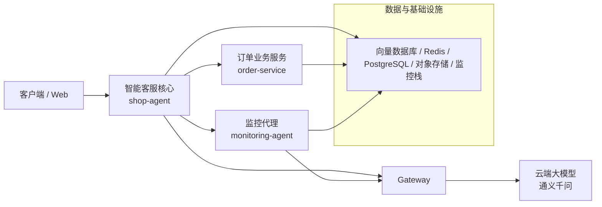
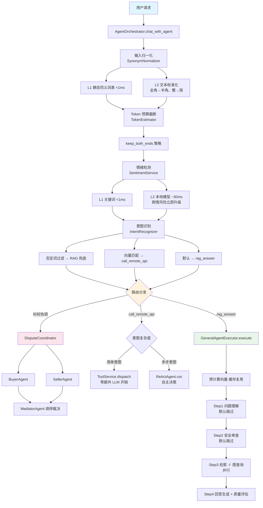

# Shop-Agent · 生产级电商多智能体客服平台

> **一个人、一年、从 0 到 1** —— 不只是"用 LangGraph 搭了个 Agent"，而是把 Agent 上生产必需的
> **编排调度 · LLM 网关治理 · 监控根因 · 自愈闭环 · 成本控制** 这条全链路都补齐了。

`Python 3.10+` · `FastAPI` · `LangGraph` · `LiteLLM` · `Milvus` · `NebulaGraph` · `vLLM` · `Prometheus/Grafana/Loki` · `Docker Compose / K8s`

---

## 30 秒看懂这个项目

Agent 的难点从来不是"能不能跑通 demo"，而是**上生产之后的四个真问题**。这个项目的价值在于逐个解决了它们：

| 真问题 | 怎么解的 | 结果 |
|---|---|---|
| **慢** | 三级工具选择流水线（规则过滤 → 向量语义 → 本地小模型），高置信时直接确定性派发，跳过 ReAct 循环 | 工具选择 **850ms → 80ms** |
| **贵** | 语义缓存 + 预计算 embedding 复用 + Prompt token 预算守卫 + 本地小模型替代云端调用 | Token 成本 **-90%+** |
| **选不准** | 脚本合成训练集解决冷启动，SFT + QLoRA 微调 Qwen2.5-1.5B 专做工具选择 | 命中率 **23% → 97%**；任务完成率 **68% → 92%** |
| **不可控** | 参数硬强制（高后果字段从工具 schema 切除，模型无权写入）+ 敏感操作 HITL + 编译期 fail-closed 校验 | 高后果参数 100% 确定性定稿 |
| **看不见** | 独立 monitoring-agent：告警摄入 → RCA 根因归因 → 干跑预览 → 人工审批 → 受限执行 | 自愈闭环 + 审计留痕 |

**两处最能体现工程判断的设计**（细节见下文）：

- **YAML 编排不是"配置化"那么简单** —— 业务用声明式配置流程，但安全边界由编译期校验锁死：敏感 Skill 只能黑盒引用，携带 `sop_override` / `disable_hitl` 这类覆盖键直接拒绝发布。 **[详见 §13](#13-yaml-驱动的多步-agent-编排)**
- **LLM 流量必须有统一出口** —— 自研网关（基于 LiteLLM 二次开发）收口所有模型流量，做多厂商路由、限流、预算、熔断、PII 脱敏、降级。 **[详见 §多应用架构](#多应用架构)**

> ⚠️ 这是一个**独立的完整项目**（非公司产品、无真实线上流量）。上述指标均在自建环境与自建评测集上实测得出，
> 评测方法与局限见 [benchmark/](benchmark/)。仓库内标注"默认关闭/内存实现"的模块为演进中的部分，未做包装。

---

## 多应用架构


```mermaid
flowchart LR
    Client[客户端 / Web] --> ShopAgent[智能客服核心<br/>shop-agent]
    
    ShopAgent --> OrderService[订单业务服务<br/>order-service]
    ShopAgent --> Monitoring[监控代理<br/>monitoring-agent]
    
    ShopAgent --> Gateway
    Monitoring --> Gateway
    
    Gateway --> LLM[云端大模型<br/>通义千问]
    
    subgraph 数据与基础设施
        direction TB
        Infra[向量数据库 / Redis / PostgreSQL / 对象存储 / 监控栈]
    end
    
    ShopAgent --> Infra
    OrderService --> Infra
    Monitoring --> Infra
```

| 应用 | 职责 | 技术栈 |
|------|------|--------|
| `apps/shop-agent` | 智能客服核心服务（Agent 编排、RAG、ReAct、MCP/A2A 协议） | Python 3.10+, FastAPI, LangChain/LangGraph |
| `apps/gateway` | LLM 统一网关（路由、负载均衡、故障转移、限流），所有 LLM 流量的唯一出口 | Python 3.10+, LiteLLM Router |
| `apps/monitoring-agent` | 监控代理：RCA 根因分析、告警摄入（Alertmanager/Langfuse）、自愈闭环（干跑预览→人工审批→受限执行）、审计查询 | Python 3.10+, FastAPI, psycopg3 |
| `apps/order-service` | 订单/物流/售后业务服务 | Rust |

## 功能概览

### 1. Agent 编排与路由

系统采用 **Orchestrator 模式**（`AgentOrchestrator`），按以下流程统一处理请求：

- **输入归一化** — 同义词归一化 `SynonymNormalizer`（静态映射 <1ms + 文本标准化，默认开启；LLM 兜底按配置关闭）
- **情绪检测** — `SentimentService` 级联分类器（关键词 <1ms → 本地模型 ~30ms → 云端 LLM 兜底），舆情风险立即升级不走后续管线
- **Token 预算截断** — 用户输入超限时智能截断（`keep_both_ends` 策略，保留首尾内容）
- **意图识别** — 基于向量匹配的本地意图分类，识别订单查询、物流查询、退货退款、余额查询、优惠券查询五种业务意图，支持否定词过滤（咨询类模式直接走 RAG）和 LLM 兜底模式
- **路由分发** — 意图命中后，先做纠纷协调检测，再根据复杂性分发：
  - **纠纷协调**：买方诉求 + 卖方立场并行分析 → 调停裁决，含分布式锁防重复执行
  - **ReAct Agent**：多步意图（含推理/条件判断/退货类），Agent 自主决策
  - **直接 Tool 调用**：简单意图，参数抽取后直接调用对应工具，零额外 LLM 开销
  - **RAG Agent 兜底**：未命中意图的通用问答，走 4 步流水线（问题理解 → 内容审查 → 知识检索 → 回答生成）
- **人在回路**：退款审批场景，Agent 自动暂停返回待确认状态，管理员通过接口确认或拒绝

### 2. ReAct Agent（工具调用 + RAG 融合）

基于 LangChain `create_agent` + LangGraph `MemorySaver` 的 ReAct 循环，配套三层工具选择策略：

- **P0 意图前置过滤**：Skill 注册表自动构建候选映射 → 缩减候选工具池
- **P1 语义重排**：用户 query × 工具描述向量相似度 + 意图加权 → Top-K
- **P2 本地模型确认**：本地小模型从候选集中选出最相关的工具，不可用时回退到云端兜底

Agent 行为由 **Skill SOP 内联注入** 驱动：启动时 `SkillLoader` 从 `skills/*/SKILL.md` 加载定义到注册表，运行时命中 Skill 后将 SOP 注入 system prompt，实现"增加新业务只改配置"。

#### 规划 / 执行解耦（Think-Act Decoupling）

P0/P1/P2 三层工具选择只产出**结构化的 `ToolPlan`**，不再由 LLM/小模型直接控制"何时停止"或驱动 ReAct 循环。这是 Plan-and-Execute 范式在 ReAct Agent 中的落地：

- **规划产物**：`ToolPlan`（`schemas.py`）含 `actions: List[PlannedAction]`（每项带 `name` / `source: p0|p1|p2` / `confidence` / `preset_params`）、`source` 与 `stop_condition` 信号。
- **`stop_condition` 信号**：
  - `plan_complete` —— 规划侧已高置信（`is_confident`：单工具且来源 P0/P1，或 P2 且 ≤2 工具），执行侧**跳过 ReAct 循环**直接确定性 `ToolService.dispatch` 派发，再由 LLM 仅做自然语言润色。
  - `need_llm` —— 置信不足，正常进入 ReAct 自主决策。
- **hitl 保护**：含 `request-return` 等 `hitl` 工具的 plan 强制走 ReAct，以触发人机确认中断，不被 `plan_complete` 短路。
- **零回归**：`simple`/`direct_tool` 路径与 ReAct 核心循环不受影响；解耦仅新增 `run()` 内的短路分支 + `_execute_plan_directly` 执行器，规划侧复用既有的 P0/P1/P2 收敛结果。

收益：高置信简单意图零额外 ReAct 推理开销（更少 LLM 往返），模型退居"润色"而非"决策"，可解释性与确定性提升。

### 3. RAG 智能对话

支持两种 RAG 路径：

- **简单 RAG**：Embedding → 向量检索 → LLM 生成，含输入归一化 + 输出内容安全过滤
- **Agent RAG**：4 步流水线：
  - Step 1 问题理解/改写（默认禁用）
  - Step 2 内容安全审查（默认禁用，含本地优先 + 云端复核的双层策略）
  - Step 3 知识检索（混合检索 + 图查询并行）
  - Step 4 回答生成 + 规则质量评估 + 输出安全过滤

增强能力：
- **预计算向量复用**：入口预计算 question embedding，供检索复用，避免重复调用 Embedding API
- **Reranker 重排序**：对检索结果按相关性重新打分和截断，失败时不阻塞主流程
- **LLM 相关性过滤**：检索结果经语义相关性判断，过滤无关文档
- **图查询增强**：商品关系图谱与向量检索并行执行，结果注入 prompt，解决纯向量检索无法处理的关联推荐问题

### 4. 文档知识库管理

支持向向量知识库导入文档，提供单条插入、批量插入和文件上传三种方式。内部两层切分策略：语义切分 → Token 安全兜底二次切分。

### 5. 商品嵌入与搜索

支持将商品标题向量化存入向量数据库，批量嵌入，及文件上传嵌入。支持混合检索搜索商品，按商品 ID 去重。

### 6. 企业信息查询

基于关系数据库的企业信息模型，Repository 层支持模糊匹配、精确匹配、地区/行业筛选等多维度查询。

### 7. 问题缓存去重

基于 Redis 的向量相似度搜索，支持精确哈希匹配与向量余弦相似度匹配双重策略。缓存回答经质量评估后存储。同时支持对话历史存储和高频问题统计，包含问题脱敏处理。

### 8. 内容安全过滤

纯规则引擎（零 LLM 成本），提供：
- **输入过滤**：拦截明显恶意/非法内容 + Prompt Injection 检测
- **输出过滤**：按领域配置关键词表，LLM 输出在返回用户前强制扫描
- 纵深防御位置：编排器入口 → Agent 输入审查 → 执行器输出过滤

### 9. 可观测性

- **monitoring-agent（独立服务）**：
  - **RCA 根因分析**：接收 Alertmanager/Langfuse 告警，做确定性规则归因 + 可选 LLM 归纳，输出 `severity/root_cause/affected/recommendations/remediation`
  - **自愈闭环**：`POST /remediate/preview`（沙箱验证 + 证据包）→ `POST /remediate/approve`（人工审批）→ `POST /remediate/apply`（受限执行），状态机守卫防重
  - **审计查询**：`GET /rca/history`（RCA 历史）、`GET /remediate/plans`（计划/审批/执行记录）
  - **持久化**：PostgreSQL（`rca_runs/remediation_plans/approvals/executions`），DB 降级不影响主链路
  - **Prometheus 指标**：`rca_total`、`rca_persisted_total`、`persist_failure_total`、`remediate_plans_total`、`approvals_total`、`executions_total`
  - **Docker 沙箱**（已实现，本期默认关闭）：可切换的隔离执行环境，当前默认仿真后端干跑验证；触发条件满足时（LLM 生成任意脚本 / 自动执行 / 第三方插件）切换为 Docker 容器隔离（网络受限 + 资源上限 + 库白名单），确保不可信代码在可控边界内运行，不直接影响生产环境
- **Prometheus**：自动暴露 HTTP 请求指标，业务自定义指标（API 调用、数据库查询、向量检索、Embedding 请求、缓存、Agent 对话、Token 消耗、异常统计），LangChain 标准回调处理器追踪 LLM/Agent/Tool 事件
- **SkyWalking**：gRPC 上报分布式链路追踪，与 Prometheus 互补，不可用时优雅降级
- **Langfuse**：全链路追踪 LLM 调用、Agent 执行、意图识别、参数抽取、工具匹配，shutdown 时 flush 确保数据不丢失

### 10. 参数抽取

支持四种模式，逐级兜底：
- **local_strict**：纯正则 + 关键词，毫秒级，零 API，不降级
- **local**：正则 → 失败降级本地模型 → 失败降级 LLM（默认）
- **local_model**：本地小模型 → 失败降级 LLM
- **llm**：结构化输出，最精准

### 11. MCP 协议（Model Context Protocol）

基于 FastMCP 框架将 Skill 体系通过 MCP 协议对外暴露，使外部 AI 客户端可以调用本系统的业务工具。

- **核心原则：MCP 对外，不对内** — 外部 Client 通过 JSON-RPC 调用，内部同进程直调
- `tools/list` — 从 Skill 注册表自动生成 tool 列表及参数 schema
- `tools/call` — 映射到 `ToolService.dispatch(action, params)`
- 传输模式：`stdio` / `sse` / `streamable-http`，默认 `stdio`

### 12. A2A 协议（Agent-to-Agent）

自研 A2A 协议，使外部 Agent 系统能够以标准化的方式发现能力、提交异步任务、共享对话上下文。

- **能力发现**：`GET /.well-known/agent-card.json` 无需认证，动态生成，首次构建后缓存
- **异步任务管理**：提交任务立即返回 `task_id`，后台异步执行，支持取消；任务状态外置 Redis（跨节点可见，7 天 TTL），Redis 不可用时降级内存
- **Webhook 回调通知**：任务完成/失败时向两路目标广播 —— ①订阅表（`POST /a2a/webhooks` 注册，携带各订阅者自己的 HMAC 密钥）②任务自带的 `callback_url`（无密钥，向后兼容）；回调失败不影响任务本身
  - **HMAC 签名**：订阅时传入 `secret` 才启用签名（`X-A2A-Signature: sha256=...`）；密钥仅在服务内部保存，`WebhookSubscriptionResponse` 中 `exclude=True` 不外泄
- **对话上下文共享**：列出对话摘要、获取历史消息，供其他 Agent 查询（**当前为进程内内存存储**，重启丢失、多实例不共享，升级路径见代码注释）
- **健康检查**：返回 LLM、Vector DB、Redis、MCP Server 等依赖状态
- **已知边界**：取消任务仅对提交它的那个进程内的异步任务生效（跨节点取消需共享调度器）；Webhook 订阅表同为进程内存储

> 回归测试：`apps/shop-agent/tests/test_a2a_tasks.py`（26 项），覆盖任务生命周期、订阅 CRUD、双通道广播、签名生成与端到端通知。

### 13. YAML 驱动的多步 Agent 编排

除代码内 `AgentOrchestrator` 编排外，系统额外提供 **YAML 驱动编排**：用本地 YAML 文件描述 Agent 编排图，本地解析器将其编译为 LangGraph 可执行图并运行。设计原则（详见《29-从ReAct黑盒到可视化编排》）：**控制流外移、模型退居节点内、安全底座不下放**。

- **节点类型（14 种）**：`normalize` / `truncate` / `sentiment` / `intent` / `rag_pipeline` / `direct_tool` / `react` / `dispute` / `human_approval` / `input_filter` / `output_filter` / `lock` / `persist` / `observe`。
  - 引擎原语节点（normalize / input_filter / lock 等）是内置原子能力，**不指向任何 Skill**；`react` / `direct_tool` / `rag_pipeline` 类节点通过 `config.skill: <skill_id>` 从 `SkillRegistry` 绑定对应 Skill 的 SOP 与工具，敏感 Skill 只能被引用为黑盒，不可内联改写其 SOP 或校验规则（见「YAML 编排与安全固化」）。
- **条件边**：节点 `condition` 支持 `on_intent==` / `on_complexity==` / `on_emergency` / `always` / 自定义表达式，编译为 LangGraph 条件路由。
- **声明式参数传递**：以 `GraphState`（TypedDict，含 `messages` / `intent` / `params` / `tool_result` / `hitl_pending` / `thread_id`）替代现状隐式三通道（messages 列表 + `ReActRunContext` 闭包 + system prompt 拼接）。节点 `config` 声明 `read_from` / `write_to` 做字段映射，**节点函数不感知上下游节点名**；`required: true` 的 `read_from` 字段缺失则编译/运行期 fail-closed，避免静默空参导致工具误用。
- **流程与 Skill 正交**：Skill = 单节点的 SOP 与工具实现；流程 = 节点的连接顺序。一个 Skill 可被多流程节点引用，一个流程可串多个 Skill + 非 Skill 原语。
- **细粒度编排（子图）**：`react` 节点可用 `subgraph` 引用子图，将 ReAct 内部步骤（查单→校验→确认→执行）显式拆为子图节点，编译器内联展开（`<node.id>__<sub_id>` 前缀），子图内 `human_approval` 的 `interrupt` 落在父图层，resume 与顶层一致。RAG 固定四步也可拆为 `rag_rewrite` / `rag_review` / `rag_retrieve` / `rag_generate` 四个 YAML 节点。
- **校验与调试**：内置 YAML 校验器（`validator.py`）做必填字段、边引用合法性、entry 存在性、read_from 存在性与 required 校验；解析器兼容 LangGraph Studio 调试入口（`get_graph()`）。

### 14. 分层记忆架构

系统实现四层记忆体系，解决 Agent "每天失忆"问题：

- **L1 工作记忆**：Redis List 存储当前对话轮次（最近 20 轮），1 天 TTL
- **L2 短期记忆**：Milvus 向量存储，最近 7 天对话摘要，轮次触发（每 5 轮）+ 批量兜底
- **L3 长期记忆**：PostgreSQL（用户画像/订单/投诉结构化数据）+ Milvus（向量化记忆），LLM 提取 + 事件驱动更新
- **L4 知识记忆**：现有 RAG 知识库，商品信息/政策文档/FAQ

核心能力：
- **MRAG 检索融合**：RAG 路径自动召回 L2/L3 记忆，与知识库结果统一注入 Prompt
- **记忆提取**：LLM 从对话中提取结构化记忆（偏好/订单/投诉/待办），异步执行不阻塞响应
- **遗忘机制**：重要性加权遗忘（90 天归档 / 365 天删除），K8s CronJob 每日执行
- **可观测性**：Prometheus 指标覆盖召回延迟/命中率/上下文大小，标准测试回归测试

记忆作为横切关注点集成，不修改现有 Pipeline 的 4 步序列。

---

## shop-agent架构

### 编排队列


```mermaid
flowchart TD
    A[用户请求] --> B[AgentOrchestrator.chat_with_agent]

    B --> C[输入归一化<br/>SynonymNormalizer]
    C --> C1[L1 静态同义词表 <1ms]
    C --> C2[L2 文本标准化<br/>全角→半角、繁→简]

    C1 --> D
    C2 --> D

    D[Token 预算截断<br/>TokenEstimator]
    D --> D1["keep_both_ends 策略"]

    D1 --> E[情绪检测<br/>SentimentService]
    E --> E1[L1 关键词 <1ms]
    E --> E2[L2 本地模型 ~30ms<br/>舆情风险立即升级]

    E1 --> F
    E2 --> F

    F[意图识别<br/>IntentRecognizer]
    F --> F1[否定词过滤 → RAG 兜底]
    F --> F2[向量匹配 → call_remote_api]
    F --> F3[默认 → rag_answer]

    F1 --> G
    F2 --> G
    F3 --> G

    G{路由分发}

    G -->|纠纷协调| H[DisputeCoordinator]
    H --> H1[BuyerAgent]
    H --> H2[SellerAgent]
    H1 --> H3[MediatorAgent 调停裁决]
    H2 --> H3

    G -->|call_remote_api| I{意图复杂度}
    I -->|简单意图| I1[ToolService.dispatch<br/>零额外 LLM 开销]
    I -->|多步意图| I2[ReActAgent.run<br/>自主决策]

    G -->|rag_answer| J[GeneralAgentExecutor.execute]
    J --> J1[预计算向量 缓存复用]
    J1 --> J2[Step1 问题理解<br/>默认跳过]
    J2 --> J3[Step2 安全审查<br/>默认跳过]
    J3 --> J4["Step3 检索 ∥ 图查询<br/>并行"]
    J4 --> J5[Step4 回答生成 + 质量评估]

    style A fill:#e1f5fe
    style G fill:#fff3e0
    style H fill:#fce4ec
    style J fill:#e8f5e9
```

### 模块划分

| 模块 | 职责 |
|------|------|
| `src/core` | 全局配置管理、Token 预估器、速率限制器 |
| `src/shared` | 异步数据库引擎、统一异常体系、结构化日志、统一响应格式 |
| `src/modules/auth` | Bearer Token API Key 认证鉴权 |
| `src/modules/chat` | 智能客服核心模块，含 A2A 协议路由 |
| `src/modules/chat/agent` | Agent 编排、通用执行器、ReAct Agent、Skill 加载器、提示词管理、纠纷协调器 |
| `src/modules/chat/core` | LLM 服务、Embedding 服务、向量检索服务、Redis 缓存服务、意图识别器、文档服务、Reranker 服务、工具注册与服务、本地模型服务、内容安全过滤、同义词归一化、情绪检测、图查询服务、参数抽取器、**记忆服务（L2/L3/MRAG/遗忘）**、MCP Server、A2A 任务服务、A2A Webhook 服务、Agent Card 构建器 |
| `src/modules/items` | 企业信息查询，路由前缀 `/reports` |
| `src/modules/monitoring` | Prometheus 指标定义 + LangChain 回调 + Langfuse 回调 + SkyWalking 分布式追踪客户端 |

---

## 关键设计决策

### 大模型：通义千问（Qwen）

通过 OpenAI 兼容模式接入阿里云 DashScope，默认模型为 `qwen3.7-plus-2026-05-26`。`LLMService` 采用单例模式，Agent 回答生成使用 `temperature=0.3`。

### 嵌入模型：vLLM 进程外部署

通过 `EMBEDDING_PROVIDER=vllm` + `VLLM_EMBEDDING_BASE_URL` 调用部署在 vLLM 中的 `BAAI/bge-m3`（默认 `http://vllm-bge-m3:8000`）。shop-agent 进程内不加载任何模型权重；本地 `LocalEmbeddings`（sentence-transformers）仅作为 `EMBEDDING_PROVIDER=local` 时的调试兜底。全链路多个消费方（意图匹配 + RAG 检索 + 语义缓存）统一不加指令前缀。

### 意图识别：本地向量优先

默认使用本地向量匹配，5 种业务意图各若干示例短语，支持否定词过滤（咨询类模式直接走 RAG）、复杂性检测（退货类永走 Agent）和 LLM 兜底。

### 混合检索策略

使用原生混合检索（Dense HNSW + Sparse BM25），RRF 融合，开启 Reranker 时多取候选供重排序。检索结果经语义相关性过滤。预计算的 question embedding 复用于检索，避免重复调用 Embedding API。

### Reranker 重排序

通过 `RERANKER_PROVIDER=vllm` + `VLLM_RERANK_BASE_URL` 调用部署在 vLLM 中的 `BAAI/bge-reranker-v2-m3`（默认 `http://vllm-bge-reranker:8000`）对检索结果重新打分，支持相关性阈值截断和 Top-K 截取。shop-agent 进程内不加载 CrossEncoder；本地 `CrossEncoder` 仅作为 `RERANKER_PROVIDER=local` 时的调试兜底。Rerank 失败时不阻塞主流程，保留原始检索结果。

### 同义词归一化：三级设计

编排器入口处统一处理用户输入：
- **L1 静态同义词表**（<1ms）：将常见变体归一化为标准术语
- **L2 文本标准化**：全角→半角、繁体→简体、多余空格/标点清理
- **L3 LLM 归一化**：调用 LLM 覆盖长尾表达（默认关闭）

95% 的 case 在 L1+L2 完成，零 LLM 成本。

### 情绪检测：级联分类器

三级级联：
- **L1 关键词**（<1ms）：匹配明确情绪信号
- **L2 本地模型**（~30ms）：零样本分类
- **L3 云端 LLM**（~300ms）：边界情况兜底，极少触发

情绪等级超过阈值建议升级，紧急舆情风险强制立即升级并跳过后续管线。含 Session 情绪跟踪器（滑动窗口 + 趋势方向）。

### 纠纷协调器：多 Agent 三方协调

检测到愤怒情绪 + 退货意图时触发：
- **FactCollector**：收集客观事实（查订单/查物流/查政策）
- **BuyerAgent ∥ SellerAgent**：并行分析买方诉求与卖方立场
- **MediatorAgent**：串行等待两者结果后调停裁决

所有 Agent 复用同一 LLM 实例，仅 prompt 不同。支持 Mock 事实数据（无远程 API 时自动降级）。

**分布式锁防重**：执行前获取分布式锁（TTL 5 分钟），防止重复执行。锁使用原子释放，Redis 不可用时降级为无锁通过。

### 安全设计

四层纵深防御：
- **输入过滤**（编排器入口）：规则引擎极保守拦截，零 LLM 成本
- **Agent 输入审查**：默认禁用，启用时分两级——本地优先，失败升级云端复核
- **输出过滤**：强制规则引擎扫描 LLM 输出，block 关键词直接拦截，replace 关键词脱敏
- **审查异常保守策略**：审查步骤异常时默认高风险，确保安全优先

### 文本分块策略

语义切分作为主切分策略，通过向量相似度检测话题边界。超限 chunk 用 Token 安全兜底二次切分。Embedding 模型最大输入 4096 tokens，取 80% 安全余量。

### 参数抽取：本地优先逐级兜底

支持四种模式（见「10. 参数抽取」）。默认 `local` 模式：正则 → 失败降级本地小模型 → 失败降级 LLM。本地小模型经 `LOCAL_MODEL_BACKEND=vllm`（默认）调用部署在 vLLM 中的 `qwen3-unified`，shop-agent 进程内不加载权重；仅当显式设 `LOCAL_MODEL_BACKEND=transformers` 时才进程内加载（需 torch，生产镜像未装，仅本地调试）。同一模型还作为工具选择本地兜底。

### 图增强

商品关系图谱（同品牌/兼容配件/替代品），图查询与向量检索并行执行（不增加端到端延迟），结果注入回答生成 prompt。未启用或查询无结果时静默降级。

### 统一异常体系

分层异常类：业务异常(400) → 认证(401) / 授权(403) / 未找到(404) / 校验(422) / 数据库(500)。统一拦截并返回标准格式。

### 统一响应格式

所有接口返回统一结构，基于 Pydantic 模型构建。

### 结构化日志与脱敏

JSON 格式结构化日志，FastAPI 中间件自动记录每个请求的方法、URL、客户端 IP、User-Agent、状态码、处理耗时。API Key 仅记录前 8 位。

### 速率限制与 Token 消耗管控

两层限流：
- **请求次数限流**：Redis 滑动窗口 + 内存降级
- **Token 消耗限流**：基于 tokenizers 引擎，Pre-check → 调用 → Post-report 三阶段，LRU 缓存常用文本编码

用户输入超限时使用 `keep_both_ends` 策略智能截断。

### 对话历史管理

基于 Redis 的对话历史存储：
- 按会话 ID 分 key，每条消息截断防撑爆 Redis
- 过期时间控制，最大返回条数限制
- 回答生成时从 Redis 获取历史，截断后注入 prompt
- 不可用时返回空历史静默降级

### 记忆架构：四层分层 + MRAG 融合

- **分层设计**：L1（Redis，1 天）/ L2（Milvus，7 天摘要）/ L3（PG+Milvus，永久结构化记忆）/ L4（Milvus，知识库）
- **单 Collection 复用**：L2/L3/L4 共用 `memory_blocks` Collection，通过 `block_type` 区分
- **记忆块原子性**：一条块 = 一个事实，状态变更更新原块，历史事实新建块
- **MRAG 检索**：仅 RAG 路径加载 L2/L3，ReAct/direct_tool/纠纷协调不加载，避免性能损耗
- **Prompt 注入顺序**：用户画像 → 近期对话摘要 → 历史记忆 → 知识库结果
- **降级优先**：记忆系统故障时静默降级为纯 RAG，不影响主链路

### Token 消耗优化

- 检索文档截断后传给 LLM
- 对话历史每条截断后注入
- 相关性过滤限制文档数量
- 回答生成 prompt 中多个占位符复用同一检索上下文
- Prompt token 预算守卫：生成前估算，超限时逐篇丢弃检索文档，极端情况全部丢弃，纯模型常识回答
- 入口预计算一次 question embedding，复用于缓存检查 + 检索

### 单品单例服务模式

LLM 服务、Embedding 服务、向量数据库服务、Redis 缓存服务、Reranker 服务、本地模型服务、内容安全过滤服务均采用单例模式，避免重复初始化连接和模型加载。

### 规划/执行解耦：Plan-and-Execute 落地

ReAct Agent 的工具选择（P0/P1/P2 三层收敛）与工具执行彻底解耦：

- **规划层确定性产出 `ToolPlan`**：`_select_tools_for_intent` 用 `ToolPlan` 组织候选（P0 建 plan → P1 覆盖 → P2 本地模型确认覆盖，P1/P2 始终附加 `knowledge_search`），末尾按 `is_confident` 判定 `stop_condition`，存入 `self._last_tool_plan`。
- **执行层消费计划而非模型决策**：`run()` 在 `plan_complete` 且不含 hitl 工具时，调用 `_execute_plan_directly` —— 逐个 `dispatch` 执行 → LLM 仅润色 → 输出安全过滤 → 返回 `ChatResponse`（steps 标记 `plan_complete_direct` 模式）。
- **边界**：`hitl` 工具（`SkillDef.hitl=True`，如 `request-return`）必须走 ReAct 以触发 `interrupt()` 人机确认；`simple`/RAG 路径完全不受影响。

该设计对齐 OpenAI tool-calling、LangChain PlanAndExecute、Claude agent 模式等成熟范式，核心思想是"模型负责想清楚（plan），执行器负责把事办成（act）"。

### 人在回路：退款审批

处理退款请求时，通过状态标志位传递中断上下文。Agent 返回待确认状态含订单号/原因，管理员确认或拒绝。防御重复调用。

在 **YAML 编排**模式下，人在回路升级为基于 checkpointer 的**跨请求状态机**：执行到 `human_approval` 节点时经 LangGraph `interrupt()` 挂起，将 `InterruptContext` 写入 checkpointer；通过 `resume(thread_id, confirm)` 入口按图恢复并继续（`Command(resume=confirm)` 经 `ApprovalGate.approve/reject` 执行）。审批前后都走输出安全过滤（fail-closed 兜底），`thread_id` + `hitl_pending` 随 checkpointer 持久化，resume 时原样取回上游 `params` / `tool_result`。

### YAML 编排与安全固化

YAML 编排将安全边界从"代码特判"上移到"声明 + 编译期强校验"，落实《29-从ReAct黑盒到可视化编排》的三层限制：

- **硬强制声明**：节点 `config.hardcode` 声明哪些参数字段由前置确定性抽取强制、是否从 schema 剔除；解析器据此生成"闭包预设 + schema 字段剔除"的工具。若 `read_from: state.params` 的字段同时被 `hardcode` 覆盖，以硬强制值优先注入工具闭包，`params` 中同名键视为不可信输入剔除。
- **编译期 fail-closed**：敏感 Skill（risk=high/hitl，如 request-return、check-balance）的高后果字段（order_id/phone 等身份-资金类或 required 字段）必须在节点经 `config.hardcode` 定稿注入或 `read_from` 提供确定性来源，否则 **YAML 校验拒绝发布**；敏感 Skill 被引用时其 SOP 正文必须非空，否则拒绝发布；输入/输出过滤守卫节点缺失则编译失败；携带 `sop_override` / `skip_validation` / `disable_hitl` 等安全覆盖键则拒绝发布。
- **`risk` / `hitl` 元数据驱动**：`SkillDef` 新增 `risk` / `hitl` 字段（由 SKILL.md frontmatter 解析），替代 `react_agent.py` 中 `if action == "request-return"` 式特判。新增敏感 Skill 只需在 SKILL.md 标 `risk: high` + `hitl: true` 即自动套用安全逻辑，无需改代码。
- **流程与 Skill 安全底座共享**：流程层（守卫强制 / 敏感节点不可改）与 Skill 层（硬强制）复用同一底座（确定性定稿 + 强制注入 + 审计留痕），业务能自助组合节点顺序，但不能改安全边界。
- **工具收敛对齐**：单 skill 绑定的 `react` 节点直接构建该 skill 工具集并绕过节点内 P0/P1/P2 精选（避免双重收敛与上下文浪费）；仅多 skill 通用入口（`config.skill` 缺失或 `multi_skill: true`）才启用精选。
- **params 单一数据源**：参数 schema 收敛至 Pydantic（`schemas.INTENT_PARAM_SCHEMAS`），工具参数构建读 `SkillRegistry.skills[action].params`，删除原 `_ACTION_PARAM_FIELDS` / `_ACTION_PARAM_DESC` 硬编码字典。

### Skill SOP 注入

运行时命中 Skill 后将 SOP 正文内联注入 system prompt（含情绪 tone 提示、输入截断提醒），实现"增加新业务只改配置"。

### MCP Server：工具体系对外开放

基于 FastMCP 实现，启动时自动扫描 Skill 注册表中所有 Skill，动态生成带类型注解的 async 工具函数：
- **自动注册**：新增 Skill 只需在 `skills/` 目录下创建定义文件，重启后自动暴露为新 Tool
- **参数 Schema 管理**：Skill 的参数定义集中管理，客户端可通过 `tools/list` 获取参数结构
- **配置项**：`MCP_ENABLED`（默认 `False`）、`MCP_SERVER_NAME`、`MCP_TRANSPORT`

### A2A 协议：自研架构决策

- **无外部 SDK 依赖**：基于 FastAPI + asyncio 自研完整协议栈
- **内存存储 → 升级路径**：当前使用内存存储，代码注释标注了持久化升级接口
- **Agent Card 加速**：首次构建后缓存，命中 <1ms；启动时预热，避免首个请求阻塞
- **A2A vs MCP 定位差异**：A2A 面向服务间互操作（异步任务 + 上下文共享），MCP 面向工具调用（同步 tools/list + tools/call），两者互补

### 基础设施容器化

通过 `docker-compose.yml` 一键编排以下服务：

- **etcd** — 元数据存储
- **MinIO** — 对象存储
- **Milvus Standalone** — 向量数据库
- **Redis Stack** — 向量缓存 + 对话历史 + 速率限制
- **Prometheus** — 监控指标采集
- **Alertmanager** — 告警路由（webhook 推送至 monitoring-agent 做 RCA）
- **Nightingale (n9e)** — 自动异常检测引擎，对 Prometheus 指标做规则检测 → 推送 Alertmanager
- **Grafana** — 可视化仪表盘
- **Langfuse** — LLM 追踪平台
- **ClickHouse** — Langfuse 分析数据库
- **PostgreSQL** — Langfuse 主数据库 + monitoring-agent 审计库

所有服务均配置健康检查。

---

## 快速开始

### 环境要求

- Python 3.10+
- Rust 1.70+（order-service）
- Docker & Docker Compose
- NVIDIA GPU + CUDA 11.8+（本地模型/微调可选）

### 安装

1. 克隆仓库并进入项目目录
2. 启动基础设施：etcd、MinIO、Milvus、Redis Stack、Prometheus、Alertmanager、Nightingale(n9e)、Grafana、Langfuse、ClickHouse、PostgreSQL
3. 安装 shop-agent 依赖
4. 安装 monitoring-agent 依赖：`cd apps/monitoring-agent && pip install -r requirements.txt`
5. 配置环境变量：填入 API Key、数据库地址、Redis 地址、`MONITORING_WEBHOOK_TOKEN` 等
6. 启动服务

### 验证

- 健康检查：访问 `/api/chatagent/health`
- 智能对话（Agent 路由）：POST `/api/chatagent/agent/chat`
- 简单 RAG：POST `/api/chatagent/chat`

### monitoring-agent API

| 端点 | 方法 | 功能 |
|------|------|------|
| `/ingest/alert` | POST | Alertmanager 告警摄入（Bearer 鉴权） |
| `/ingest/event` | POST | Langfuse 应急口摄入 |
| `/rca` | POST | 手动触发 RCA 根因分析 |
| `/rca/last` | GET | 最近一次 RCA 结果 |
| `/rca/history` | GET | RCA 历史记录（分页） |
| `/remediate/preview` | POST | 干跑预览：生成脚本 + 沙箱验证，产出 plan_id + 证据包 |
| `/remediate/approve` | POST | 人工审批（approved/rejected），状态机守卫 |
| `/remediate/apply` | POST | 受限执行（仅 approved 状态可执行） |
| `/remediate/plans` | GET | 查询计划（按 status 过滤） |
| `/metrics` | GET | Prometheus 指标 |
| `/health` | GET | 健康检查 |
| `/demo` | GET | WebSocket 实时 demo 页面 |

### 夜莺（Nightingale/n9e）闭环

监控栈的自动异常检测层：

```
N9e 规则检测 → Alertmanager 路由 → monitoring-agent /ingest/alert → RCA → 操作建议 → 审批 → 执行
```

- N9e 对 Prometheus 指标做自动异常检测（替代 Grafana ML）
- 检测到异常后推送 Alertmanager
- Alertmanager 经 webhook 推送到 monitoring-agent
- monitoring-agent 做 RCA 归因，输出 `remediation` 操作建议
- 经 `/remediate/preview` → `/remediate/approve` → `/remediate/apply` 完成自愈闭环

### 运行测试

各应用目录下运行测试命令。YAML 编排相关测试（位于 `apps/shop-agent/tests/`）覆盖：

- `test_schema_validation.py` — YAML schema 校验器（非法 YAML 报明确错误）
- `test_compiler.py` — 解析器产出图的节点数 / 边数 / 条件边路由正确（依赖校验下沉到运行期，纯结构测试无需 mock）
- `test_return_flow_e2e.py` — 现状示例 YAML 端到端 + 人在回路（request-return → 挂起 → resume confirm/reject）
- `test_hardcode.py` — 硬强制（preset 值优先注入并覆盖上游同名键、schema 字段不可见）
- `test_safety.py` — 安全边界回归（高后果字段未绑定则拒、敏感 Skill 缺 SOP 则拒、缺 output_filter 则拒、携带安全覆盖键则拒）

---

## 版本与兼容性

| 组件 | 版本/要求 |
|------|-----------|
| Python | 3.10+ |
| FastAPI | 0.100+ |
| LangChain | 0.1+ |
| LangGraph | 0.0+ |
| Milvus | 2.6+ |
| Redis Stack | 7.2+ |
| Rust (order-service) | 1.70+ |
| NVIDIA Driver | 525+（本地模型推理） |
| CUDA | 11.8+（本地模型推理） |

---

## 本地模型微调

参数抽取模型使用 LLaMA-Factory 做 QLoRA 微调。

### 训练 / 评测流程

1. 生成基础训练集
2. 训练 + 合并 LoRA + 评测对比 base vs sft
3. 单独跑评测（模型已存在时）

### GPU 验证

判断 GPU 是否真正参与训练/推理，以 `nvidia-smi` 为准。

判断标准：
- `Memory-Usage` 显存占几 GB → 模型已加载到 GPU
- `GPU-Util` 在训练 steps 阶段呈 50%–95% 抖动 → GPU 在算

> Windows 任务管理器默认显示 **"3D"** 引擎占用率，CUDA 计算跑在独立的 **Cuda / Compute** 引擎上。需切换显示才能看到真实负载。

### 训练提速配置

- `per_device_train_batch_size: 8` + `gradient_accumulation_steps: 4`（有效 batch 仍为 32）
- `preprocessing_num_workers: 4`（Windows 安全）
- **注意**：`dataloader_num_workers > 0` 在 Windows + spawn 多进程下会因 transformers 局部闭包无法 pickle 而崩溃，故保持默认 0。
